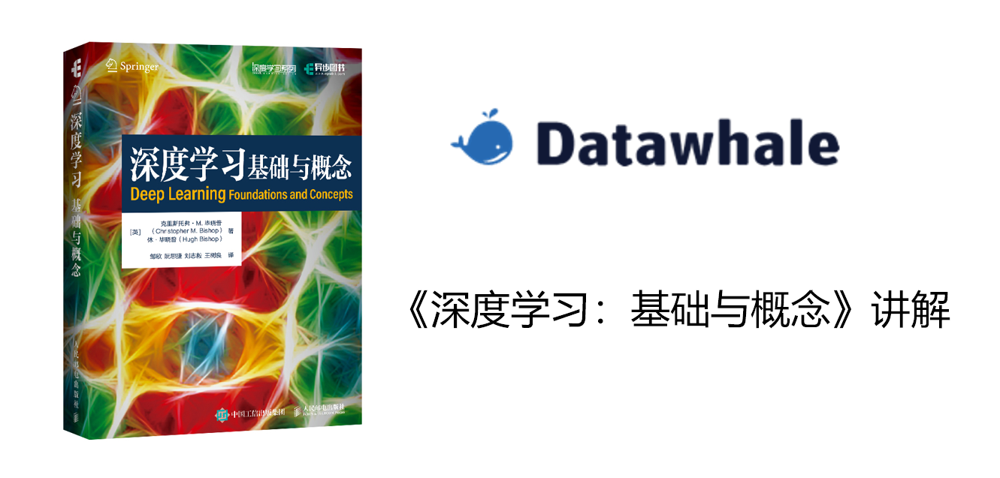

# Bishop 《深度学习：基础与概念》讲解

### 项目简介

本项目旨在对 Bishop 的新书 Deep Learning: Foundations and Concepts 的正文、附录和习题进行讲解。特别是针对工科生可能未了解、薄弱的方面进行讲解。另外对于一些较难理解的概念给出我们认为更好的讲解。

### 立项理由

自 Bishop 上一本名著《PRML》后，其与其他作者又联名撰写了 Deep Learning: Foundations and Concepts。此书知识覆盖全面，且有较强的理论基础。但对部分学生及初学者而言相对困难。不少学习者看到书中的数学推导望而却步。另外，书中推导中的跳步、未接触的新概念和新名词更成为学习者通读此书的绊脚石。
因此我们希望给出一个帮助学习者辅助阅读的材料，其中
 
1. 对学习者可能不熟悉的概念给出最少前置条件的解释
2. 对补充原书中推导被跳过的步骤
3. 对于一些重要概念给出另一个解释，帮助学习者更好的理解这个概念

### 项目受众

具有基本高等数学、线性代数基础；希望学习此书又在此过程中遇到一些困难的学习者

### 项目亮点

对应于“立项理由”中的三点，本项目的亮点为 

1. 真正从学习者视角出发的新概念解释，并说明其来源、用途；而不是简单罗列
2. 填补所有的跳步空缺，还原推导、证明中的“脚手架”，并辅以文字说明
3. 对给出我们自己对重要概念的理解，创造看待重要概念的多维视角，帮助学习者构建学科、领域之间的联系

### 项目规划

| 周数    | 章节                                     | 预估  | 视频  | 负责人  | 进度   |
| ----- | -------------------------------------- | --- | --- | ---- | ---- |
| 1–2   | Ch 1: The Deep Learning Revolution     | 2 周 |     |      |      |
| 3–5   | Ch 2: Probabilities                    | 3 周 |     |      |      |
| 6–8   | Ch 3: Standard Distributions           | 3 周 |     |      |      |
| 9–12  | Ch 4: Regression                       | 4 周 |     | 何瑞杰  |  已完成 |
| 13–16 | Ch 5: Classification                   | 4 周 |     |      |      |
| 17–20 | Ch 6: Deep Neural Networks             | 4 周 |     |      |      |
| 21–23 | Ch 7: Gradient Descent                 | 3 周 |     |      |      |
| 24–26 | Ch 8: Backpropagation                  | 3 周 |     |      |      |
| 27–29 | Ch 9: Regularization                   | 3 周 |     |      |      |
| 30–33 | Ch 10: Convolutional Networks          | 4 周 |     |      |      |
| 34–36 | Ch 11: Structured Distributions        | 3 周 |     |      |      |
| 37–40 | Ch 12: Transformers                    | 4 周 |     |      |      |
| 41–43 | Ch 13: Graph Neural Networks           | 3 周 |     |      |      |
| 44–46 | Ch 14: Sampling                        | 3 周 |     |      |      |
| 47–50 | Ch 15: Discrete Latent Variables       | 4 周 |     |      |      |
| 51–54 | Ch 16: Continuous Latent Variables     | 4 周 |     |      |      |
| 55–56 | Ch 17: Generative Adversarial Networks | 2 周 |     |      |      |
| 57–58 | Ch 18: Normalizing Flows               | 2 周 |     |      |      |
| 59–60 | Ch 19: Autoencoders                    | 2 周 |     |      |      |
| 61–64 | Ch 20: Diffusion Models                | 4 周 |     |      |      |
| 65–66 | Appendix: A–C 附录                       | 2 周 |     |      |      |
