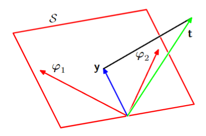

# 1 线性回归

考虑使用一个 $D$ 维特征向量预测目标值的问题。我们有一个包含了 $N$ 个数据-目标对的数据集 $\{ (\boldsymbol{x}_{n}, t_{n}) \}_{n=1}^{N}$，定义函数
$$
y(\boldsymbol{x}, \boldsymbol{w}) = w_{0} + w_{1}x_{1} + \cdots + w_{D}x_{D} \tag{Lin}
$$
其中 $\boldsymbol{x} \in \mathbb{R}^{D}$ 是输入的特征向量，$\boldsymbol{w} \in \mathbb{R}^{D+1}$ 是一个带有偏置项的权重向量。注意上面的函数是一个线性映射，因此这样的问题也叫**线性回归**。

## 1.1 基函数
上面的函数 (Lin) 可以被推广，我们对输入做不同的非线性映射 $\phi_{j}: \mathbb{R}^{D} \rightarrow \mathbb{R}$，修改过后的函数是
$$
t(\boldsymbol{x}, \boldsymbol{w}) = w_{0} + \sum\limits_{j=1}^{M-1} w_{j}\phi_{j}(\boldsymbol{x})
$$
为了简便起见，我们令 $\phi_{0}(\boldsymbol{x}) \equiv 1$，并将 $\phi_{j}(\boldsymbol{x})$ 堆叠形成一个向量 $\boldsymbol{\phi}(\boldsymbol{x}) = [\phi_{0}(\boldsymbol{x}), \dots, \phi_{M-1}(\boldsymbol{x})]^{\top}$，这样原来的函数就可以写成
$$
y(\boldsymbol{x}, \boldsymbol{w}) = \boldsymbol{w}^{\top}\boldsymbol{\phi}(\boldsymbol{x}),
$$
而直观上，我们可以使用类似神经网络的图示对其进行表达

在深度学习流行之前，机器学习工程师往往会从输入数据中提取**特征**，也就是 $\{ \phi_{j}(\boldsymbol{x}) \}$，来简化输入数据的维度，并期望提高模型的性能和/或泛化性能。因此我们的目标是找一族足够“强”的基函数族，在这个基函数族的映射下原问题可以被较好的解决，但这件事的难度不言而喻。在深度学习兴起后，我们可以学习这样的非线性映射，从而一定程度上解决上面的问题。

对于基函数族的选取，我们可以有下面这些取法
$$
\begin{align*}
\phi_{j}(\boldsymbol{x}) &= x^{j} & \text{单项式}\\
\phi_{j}(\boldsymbol{x}) &= \exp\left\{  -\frac{(\boldsymbol{x}-\boldsymbol{\mu}_{j})^{2}}{2s^{2}}  \right\} & \text{Gaussian 基}\\
\phi_{j}(\boldsymbol{x}) &= \sigma\left( \frac{\boldsymbol{x} - \boldsymbol{\mu}_{j}}{s} \right) & \text{Sigmoid 基}
\end{align*}
$$
其中 $\displaystyle \sigma(x) = \frac{1}{1 + \exp(-x)}$ 是 Sigmoid 函数，$s$ 和 $\boldsymbol{\mu}_j$ 分别是 “均值” 和 “标准差”，它们可作为可学习的参数或超参数。

不同基函数的曲线。从左至右依次是多项式、Gaussian和Sigmoid基函数

当然我们还可以选择其他的基函数。例如 Fourier 基（其中的元素为正弦和余弦函数）、小波基。这些有良好的性质，可用于分析输入的频率和局部行为。

## 1.2 似然函数

假设我们需要拟合的目标是由一个确定函数加上Gauss噪声得到的
$$
t = y(\boldsymbol{x}. \boldsymbol{w}) + \epsilon, \quad  \epsilon \sim \mathcal{N}(0, \sigma^{2})
$$
因此我们可以把上面的式子写成
$$
p(t|\boldsymbol{x}, \boldsymbol{w}, \sigma^{2}) = \mathcal{N}(t|y(\boldsymbol{x},\boldsymbol{w}), \sigma^{2})
$$
其中右侧的意思是 $t$ 服从均值为 $y(\boldsymbol{x}, \boldsymbol{w})$，方差为 $\sigma^{2}$ 的 Gauss 分布。我们考虑整个输入数据集 $\boldsymbol{X} = \{ \boldsymbol{x}_{1}, \dots, \boldsymbol{x}_{N} \}$ 和对应标签 $t_{1}, \dots, t_{N}$ 的似然函数
$$
p(\boldsymbol{t}|\boldsymbol{X}, \boldsymbol{w}, \sigma^{2}) = \prod\limits_{n=1}^{N} \mathcal{N}(t_{n}|\boldsymbol{w}^{\top}\boldsymbol{\phi}(\boldsymbol{x}_{n}), \sigma^{2})
$$
常见的操作是取对数，得到所谓的对数似然函数
$$
\begin{align*}
\ln p(\boldsymbol{t}|\boldsymbol{X}, \boldsymbol{w}, \sigma^{2}) &= \sum\limits_{n=1}^{N} \ln\mathcal{N}(t_{n}|\boldsymbol{w}^{\top}\boldsymbol{\phi}(\boldsymbol{x}_{n}), \sigma^{2})\\
&= \sum\limits_{n=1}^{N} \ln \left[ \frac{1}{\sqrt{ 2\pi }\sigma} \exp\left\{  -  \frac{(t_{n} -\boldsymbol{w}^{\top}\boldsymbol{\phi}(\boldsymbol{x}_{n}))^{2}}{2\sigma^{2}}  \right\} \right] & \text{Gauss 分布定义}\\
&= \sum\limits_{n=1}^{N} \left[ -\frac{1}{2} \ln(2\pi) - \ln \sigma - \frac{1}{2\sigma^{2}} (t_{n} -\boldsymbol{w}^{\top}\boldsymbol{\phi}(\boldsymbol{x}_{n}))^{2} \right] \\
&= -\frac{N}{2}\ln(2\pi) - \frac{N}{2}\ln \sigma^{2} - \frac{1}{\sigma^{2}} \cdot \underbrace{ \frac{1}{2}\sum\limits_{n=1}^{N} (t_{n} -\boldsymbol{w}^{\top}\boldsymbol{\phi}(\boldsymbol{x}_{n}))^{2} }_{ E_{D}(\boldsymbol{w}) }
\end{align*}
$$
其中 $E_{D}(\boldsymbol{w})$ 称为平方和损失。为了方便下面对 $\sigma^{2}$ 求导，我们不将第二项化简。

## 1.3 极大似然估计

有了对数似然函数之后我们就要求它的最大值。我们先看对 $\boldsymbol{w}$ 的梯度。注意似然函数中的前两项都和它无关，我们只需考虑第三项。第三项是一个可微的凹函数，于是其梯度为零的点就是它的极大之点，且该极大值点是全局最大值点。所以我们求它的梯度，并令其为零
$$
\begin{align*}
\nabla_{\boldsymbol{w}} \ln p(\boldsymbol{t}|\boldsymbol{X}, \boldsymbol{w}, \sigma^{2}) &= -\frac{1}{\sigma^{2}} \sum\limits_{n=1}^{N} \nabla_{\boldsymbol{w}} \left[ \frac{1}{2} (t_{n} -\boldsymbol{w}^{\top}\boldsymbol{\phi}(\boldsymbol{x}_{n}))^{2} \right]\\
&= -\frac{1}{\sigma^{2}} \sum\limits_{n=1}^{N}  (t_{n} -\boldsymbol{w}^{\top}\boldsymbol{\phi}(\boldsymbol{x}_{n})) \nabla_{\boldsymbol{w}} (t_{n} -\boldsymbol{w}^{\top}\boldsymbol{\phi}(\boldsymbol{x}_{n}))\\
&= \frac{1}{\sigma^{2}} \sum\limits_{n=1}^{N}  (t_{n} -\boldsymbol{w}^{\top}\boldsymbol{\phi}(\boldsymbol{x}_{n})) \boldsymbol{\phi}(\boldsymbol{x}_{n})^{\top}
\end{align*}
$$
进而有
$$
\sum\limits_{n=1}^{N} t_{n}\boldsymbol{\phi}(\boldsymbol{x}_{n})^{\top} = \boldsymbol{w}^{\top} \sum\limits_{n=1}^{N} \boldsymbol{\phi}(\boldsymbol{x}_{n}) \boldsymbol{\phi}(\boldsymbol{x}_{n})^{\top} \iff \sum\limits_{n=1}^{N} t_{n}\boldsymbol{\phi}(\boldsymbol{x}_{n}) = \boldsymbol{w} \sum\limits_{n=1}^{N} \boldsymbol{\phi}(\boldsymbol{x}_{n}) \boldsymbol{\phi}(\boldsymbol{x}_{n})^{\top}
$$
这里我们做一些让上面的式子变得更加工整的处理。我们定义
$$
\Phi = \begin{bmatrix}
\boldsymbol{\phi}(\boldsymbol{x}_{1})^{\top}\\
\boldsymbol{\phi}(\boldsymbol{x}_{2})^{\top}\\
\vdots \\
\boldsymbol{\phi}(\boldsymbol{x}_{N})^{\top}
\end{bmatrix} = \begin{bmatrix}
\phi_{0}(x_{1}) & \phi_{1}(x_{1}) & \cdots  & \phi_{M-1}(x_{1})\\
\phi_{0}(x_{2}) & \phi_{1}(x_{2}) & \cdots  & \phi_{M-1}(x_{2})\\
\vdots & \vdots && \vdots \\
\phi_{0}(x_{N}) & \phi_{1}(x_{N}) & \cdots  & \phi_{M-1}(x_{N})
\end{bmatrix}
$$
上面的式子就可以写成
$$
\Phi ^{\top}\boldsymbol{t} = \boldsymbol{w} \Phi ^{\top}\Phi \implies \boldsymbol{w}_{\text{ML}} = (\Phi ^{\top}\Phi)^{-1}\Phi ^{\top}\boldsymbol{t}
$$
其中 $(\Phi ^{\top}\Phi)^{-1}\Phi ^{\top}$ 被称为 $\Phi$ 的 Moore-Penose 伪逆。特别地，假如我们把目光聚焦在偏置项 $w_{0}$ 上，不难得到
$$
\begin{align*}
\nabla_{w_{0}} \ln p(\boldsymbol{t}|\boldsymbol{X}, \boldsymbol{w}, \sigma^{2}) &= -\frac{1}{\sigma^{2}} \sum\limits_{n=1}^{N} \nabla_{w_{0}} \left[ \frac{1}{2} (t_{n} -\boldsymbol{w}^{\top}\boldsymbol{\phi}(\boldsymbol{x}_{n}))^{2} \right]\\
&= -\frac{1}{\sigma^{2}} \sum\limits_{n=1}^{N}  (t_{n} -\boldsymbol{w}^{\top}\boldsymbol{\phi}(\boldsymbol{x}_{n})) \nabla_{w_{0}} (t_{n} -\boldsymbol{w}^{\top}\boldsymbol{\phi}(\boldsymbol{x}_{n}))\\
&= \frac{1}{\sigma^{2}} \sum\limits_{n=1}^{N}  (t_{n} -\boldsymbol{w}^{\top}\boldsymbol{\phi}(\boldsymbol{x}_{n})) \cdot 1\\
&= \frac{1}{\sigma^{2}}\left[ \sum\limits_{n=1}^{N} \left( t_{n} - \sum\limits_{j=1}^{M-1} w_{j}\phi_{j}(\boldsymbol{x}_{n})  \right) - Nw_{0} \right]
\end{align*}
$$
进而得到
$$
w_{0} = \underbrace{ \frac{1}{N}\sum\limits_{n=1}^{N} t_{n} }_{ \bar{t} } - \sum\limits_{j=1}^{M-1}\underbrace{ \sum\limits_{n=1}^{N} w_{j}\phi_{j}(\boldsymbol{x}_{n})   }_{ \bar{\phi}_{j} }.
$$
这表明 $w_{0}$ 做的事情其实很简单：就是估计标签平均值和所有的基函数输出平均值之和的差异。

用类似的方法也可以算 $\sigma^{2}$ 的梯度（这里我们已经算出了最优的 $\boldsymbol{w}_{\text{ML}}$）
$$
\begin{align*}
\nabla_{\sigma^{2}} \ln p(\boldsymbol{t}|\boldsymbol{X}, \boldsymbol{w}_{ML}, \sigma^{2}) &= -\frac{N}{2\sigma^{2}} + \frac{1}{(\sigma^{2})^{2}} E_{D}(\boldsymbol{w}_{\text{ML}})
\end{align*}
$$
令其为零，得到的
$$
\sigma^{2}_{\text{ML}} = \frac{2}{N}E_{D}(\boldsymbol{w}_{\text{ML}}) = \frac{1}{N} \sum\limits_{n=1}^{N} (t_{n} -\boldsymbol{w}^{\top}\boldsymbol{\phi}(\boldsymbol{x}_{n}))^{2}
$$
其实就是训练集预测结果的样本方差，这和我们的直觉相同。

## 1.4 最小二乘的几何直观

我们现在考虑上一节中出现的这个矩阵 $(\Phi ^{\top}\Phi)^{-1}\Phi ^{\top}$。我们首先把 $E_{D}(\boldsymbol{w})$ 简化一下，变成
$$
E_{D}(\boldsymbol{w}) = \frac{1}{2}\|\boldsymbol{t} - \Phi \boldsymbol{w}\|_{2}^{2}
$$
然后将 $\boldsymbol{w}_{\text{ML}}$ 代入，得到
$$
E_{D}(\boldsymbol{w}) = \frac{1}{2}\|\boldsymbol{t} - \underbrace{ \Phi (\Phi ^{\top}\Phi)^{-1}\Phi ^{\top} }_{ P } \boldsymbol{t}\|_{2}^{2}
$$
我们知道，$\boldsymbol{t}$ 总可以唯一地做出下面的正交分解：
$$
\boldsymbol{t} = \boldsymbol{t}_{\parallel} + \boldsymbol{t}_{\perp}
$$
其中 $\boldsymbol{t}_{\parallel} \in \text{Col}(\Phi)$，$\boldsymbol{t}_{\perp} \in \text{Col}(\Phi)^{\perp} = \text{Ker}(\Phi ^{\top})$。我们试试计算
$$
\begin{align*}
\Phi ^{\top}(1 - P) &= \Phi ^{\top} - \Phi ^{\top}\Phi(\Phi ^{\top}\Phi)^{-1}\Phi ^{\top} = O,\\
\Phi ^{\top}P &= \Phi ^{\top}\Phi(\Phi ^{\top}\Phi)^{-1}\Phi ^{\top} = \Phi ^{\top}.
\end{align*}
$$

我们发现 $P$ 有类似 "投影" 的性质：$1-P$ 将向量映射到 $\text{Col}(\Phi)^{\perp}$，而 $P$ 将向量映射到 $\text{Col}(\Phi)$。根据正交分解的唯一性，可以得到 $P$ 是到 $\text{Col}(\Phi)$ 的投影矩阵。事实上，投影矩阵有下面的定义

> **定义 （正交投影矩阵）**
> 方阵 $P$ 被称为投影矩阵，如果它满足下面的条件
> * $P^{\top} = P$
> * $P^{2} = P$

可以验证上面提到的 $P$ 满足这两个条件，它确实是一个投影矩阵。而在最小二乘的上下文中，这也是合理的：$\boldsymbol{t}$ 不一定在 $\Phi$ 的列空间中，最小二乘找的就是列空间中的一个元素，使得它到 $\boldsymbol{t}$ 的距离最短，而这个元素就是 $\boldsymbol{t}$ 在列空间上的投影。

需要注意的是，$P = \Phi (\Phi^{\top}\Phi)^{-1}\Phi ^{\top}$ 里面包含对 $\Phi ^{\top}\Phi$ 求逆的过程。而在实际情况中 $\Phi ^{\top}\Phi$ 往往是不可逆的。一个简单的方法是加一个扰动 $\lambda I$，其中 $\lambda > 0$，得到的也就是接下来要讲到的**岭回归**。

## 1.5 正则化

正则化是为了对抗模型的过拟合而引入的。其形式是在损失函数后添加一个正则项
$$
E_{D}(\boldsymbol{w}) + \lambda E_{W}(\boldsymbol{w})
$$
其中 $\lambda$ 是一个正实数，以平衡两项的重要性。一个常用的正则项是 $L_{2}$ 正则项 $\|\boldsymbol{w}\|_{2}^{2}$，经过一些推导后，我们可以得到其解为上一节末尾中提到的形式，也即
$$
\boldsymbol{w}_{\text{ridge}} = (\Phi ^{\top}\Phi + \lambda I)^{-1}\Phi ^{\top} \boldsymbol{t}
$$
## 1.6 高维标签的情形

假设每条训练数据对应的标签 $\boldsymbol{t}$ 是一个向量，我们假定其服从Gauss分布
$$
p(\boldsymbol{t}|\boldsymbol{x}, \boldsymbol{W}, \sigma^{2}) = \mathcal{N}(\boldsymbol{t}_{n}|\boldsymbol{W}^{\top}\boldsymbol{\phi}(\boldsymbol{x}), \sigma^{2}I)
$$
我们将所有输入向量堆叠成大矩阵 $\boldsymbol{X}$，将所有标签向量堆叠得到矩阵 $\boldsymbol{T}$ 并可以计算得到下面的对数似然函数
$$
\ln p(\boldsymbol{T}|\boldsymbol{X}, \boldsymbol{W}, \sigma^{2}) = -\frac{NK}{2}\ln (2\pi \sigma^{2}) - \frac{1}{2\sigma^{2}}\sum\limits_{n=1}^{N} \|\boldsymbol{t}_{n} - \boldsymbol{W}^{\top}\boldsymbol{\phi}(\boldsymbol{x}_{n})\|_{2}^{2}
$$
我们也能得出和一维标签相似的结果
$$
\begin{align*}
\boldsymbol{W}_{\text{ML}} &= \begin{bmatrix}
\boldsymbol{w}_{1} & \boldsymbol{w}_{2} & \cdots & \boldsymbol{w}_{K}
\end{bmatrix} \\&= (\Phi ^{\top}\Phi)^{-1}\Phi ^{\top}\boldsymbol{T} \\&= (\Phi ^{\top}\Phi)^{-1}\Phi ^{\top} \begin{bmatrix}
\boldsymbol{t}_{1} & \boldsymbol{t}_{2} & \cdots & \boldsymbol{t}_{K}
\end{bmatrix}
\end{align*}
$$
可以认为 $\boldsymbol{w}_{i}$ 负责预测标签的第 $i$ 维指标。

